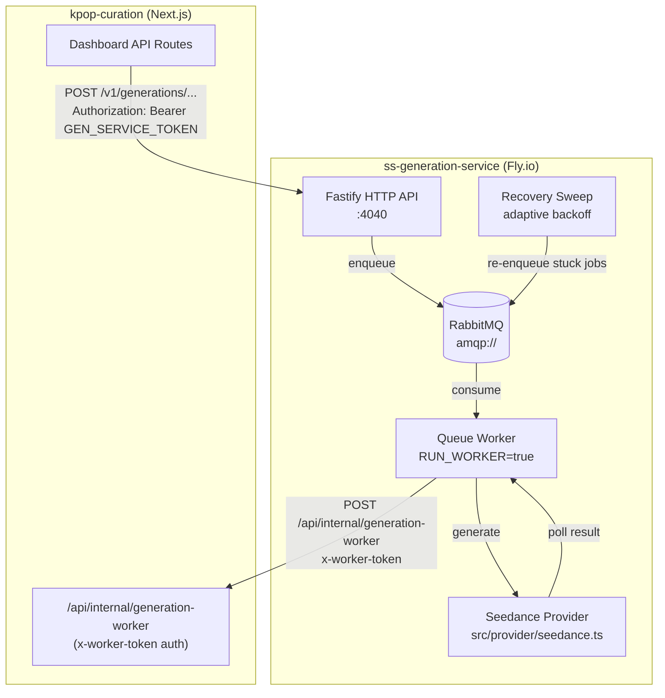
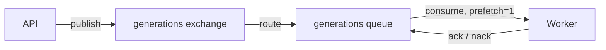

# ss-generation-service

Standalone HTTP + worker service for **video generation** jobs via Seedance. Accepts authenticated requests from the kpop-curation dashboard, enqueues work on **RabbitMQ**, calls the **Seedance** provider, and reports results back to the dashboard via webhook callbacks.

## Architecture



## Tech stack

| Layer | Technology |
|-------|-----------|
| Runtime | Node.js 20, TypeScript |
| HTTP | Fastify |
| Queue | RabbitMQ (amqplib) |
| Provider | Seedance (via MuAPI or direct) |
| Deploy | Fly.io (region: bom, 512 MB) |

---

## Getting started (local)

### Prerequisites

- Node.js 20+
- A running RabbitMQ instance (local Docker or hosted)
- Seedance / MuAPI credentials

### 1. Install

```bash
cd generation-service
cp .env.example .env
# fill in .env with real values
npm ci
```

### 2. Configure environment variables

| Variable | Required | Description |
|----------|----------|-------------|
| `HOST` | No | Bind address. Default `0.0.0.0` |
| `PORT` | No | HTTP port. Default `4040` |
| `GEN_SERVICE_TOKEN` | Yes | Shared bearer token — must match `GEN_SERVICE_TOKEN` on the dashboard |
| `RABBITMQ_URL` | Yes | AMQP connection URL, e.g. `amqp://localhost:5672` |
| `MUAPI_BASE_URL` | No | Defaults to `https://api.muapi.ai` |
| `MUAPI_API_KEY` | Yes | MuAPI key used by the Seedance provider |
| `DASHBOARD_BASE_URL` | Yes | Public URL of the dashboard (no trailing slash), e.g. `https://curation.valnoraelric.com` |
| `GEN_WORKER_TOKEN` | Yes | Shared secret sent as `x-worker-token` header to the dashboard callback |
| `RUN_WORKER` | No | Set `true` to start RabbitMQ consumers in the same process |
| `RECOVERY_SWEEP_MIN_MS` | No | Min interval for recovery sweep. Default `15000` |
| `RECOVERY_SWEEP_MAX_MS` | No | Max interval for recovery sweep. Default `300000` |
| `RECOVERY_SWEEP_IDLE_GUARD_MS` | No | Guard window before sweep runs after idle. Default `30000` |

### 3. Run

```bash
# API only (no queue consumers)
npm run dev

# API + worker in one process
RUN_WORKER=true npm run dev
```

---

## Worker mode

The service supports split API / worker deployment:

```
# API replicas (handle inbound HTTP from dashboard)
RUN_WORKER=false (or unset)

# Worker replicas (process queue, call Seedance, callback to dashboard)
RUN_WORKER=true
```

In local development, `RUN_WORKER=true` runs both in one process for simplicity.

### Queue topology



Dead-lettered or unacknowledged messages are re-enqueued by the recovery sweep.

---

## Fly.io deployment

### Prerequisites

- [flyctl](https://fly.io/docs/getting-started/installing-flyctl/) installed
- Access to the `ss-generation-service` Fly app

### Deploy

```bash
cd generation-service
fly deploy
```

The `fly.toml` is already configured:
- **App**: `ss-generation-service`
- **Region**: `bom` (Mumbai)
- **Memory**: 512 MB
- **Port**: 4040
- **Health check**: `GET /health`

### Set secrets on Fly

```bash
fly secrets set \
  GEN_SERVICE_TOKEN="..." \
  GEN_WORKER_TOKEN="..." \
  RABBITMQ_URL="amqps://..." \
  MUAPI_API_KEY="..." \
  DASHBOARD_BASE_URL="https://curation.valnoraelric.com"
```

### Scale workers

```bash
# Add a dedicated worker machine
fly scale count 2 --region bom
# Set RUN_WORKER on worker machines via process groups (see fly.toml [processes] section)
```

---

## API reference

All endpoints require `Authorization: Bearer <GEN_SERVICE_TOKEN>`.

| Method | Path | Description |
|--------|------|-------------|
| `GET` | `/health` | Health check — returns `{ ok: true }` |
| `POST` | `/v1/generations/base` | Enqueue a base image generation job |
| `POST` | `/v1/generations/poses` | Enqueue a pose/look generation job |
| `GET` | `/v1/generations/:id` | Poll status of a generation job |

Worker callback (outbound, to dashboard):

| Method | Path | Auth |
|--------|------|------|
| `POST` | `DASHBOARD_BASE_URL/api/internal/generation-worker` | `x-worker-token: GEN_WORKER_TOKEN` |

---

## Project structure

```
generation-service/
├── src/
│   ├── api/
│   │   ├── routes.ts        # Fastify route definitions
│   │   └── seedance.ts      # Seedance-specific request handlers
│   ├── provider/            # MuAPI / Seedance HTTP client wrappers
│   ├── quality/             # Output quality scoring utilities
│   ├── queue/
│   │   ├── rabbit.ts        # RabbitMQ connection + channel management
│   │   ├── topology.ts      # Exchange / queue declarations
│   │   └── worker.ts        # Consumer: dequeue → generate → callback
│   ├── config.ts            # Env var parsing and validation
│   ├── index.ts             # Entry point: Fastify app + optional worker start
│   └── types.ts             # Shared TypeScript types
├── .env.example
├── Dockerfile
└── fly.toml
```

---

## Security

- Never commit `.env` files or API keys.
- `GEN_SERVICE_TOKEN` authenticates inbound requests from the dashboard.
- `GEN_WORKER_TOKEN` authenticates outbound worker callbacks to the dashboard.
- The dashboard's `/api/internal/generation-worker` route is excluded from session middleware — it is gated by `x-worker-token` only.
- The generation service does not need CORS configured for the browser — all traffic is server-to-server.

---

## Related repository

The dashboard app that enqueues jobs and consumes completion webhooks: **[kpop-curation](https://github.com/Suryanandx/kpop-curation)**
